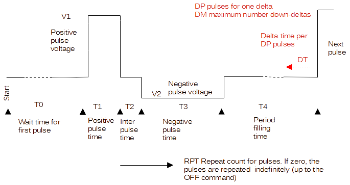

# milliPillar universal stimulator firmware V.2

### Introduction
-------

The [miliPillar platform](https://pubs.acs.org/doi/10.1021/acsbiomaterials.1c01006) contains a stimulator based on the
Arduino Uno development board. The software for that system is at the moment inflexible and static. It can not produce
all types of stimuli as described in Electrical-stimulation-of-excitable-tissue-design-of-efficacious-and-safe-protocols.pdf.

This project contains the source for a more universal firmware on the same hardware, which can change the stimulus waveform
and repetition rate on the fly.

The definitions for the settings are given using the figure below.

The parameters are as follows:

| Parameter   | Description                                                       |
|-------------|-------------------------------------------------------------------|
| T0          | Time (in us) before repeated pulses start after the 'RUn' command |
| T1          | Time (in us) of the positive going pulse                          |
| T2          | Time (in us) of  the interphase delay ( 0 means 'no interphase delay') |
| T3          | Time (in us) of the negative going pulse ( 0 means 'no negative pulse') |
| T4          | Time (in us) to fill up a complete period (the maximumin case of decreasing periods) |
|  |    |
| V1    | Voltage (in units of 0.1Volt / 100 mV) for the positive pulse |
| V2    | Voltage (in units of 0.1Volt) for the negative pulse |
|  |    |
| DT    | Delta time (in us): amount which will decrease the period time every time DP pulses are emitted (0 means there is no frequency increase)  |
| DP    | Delta pulses: amount of pulses after which the peeriod timewhich will decrease the period time every time DP pulses are emitted  |
| DM    | Delta max: the maximum number of dreceasing instances after which the period time is reset to T4 and cycling starts again  |
|  |    |
| RPT   | Number of pulses to be given after the 'RUn' command (0 means the pulses go on forever / until the 'OFf' command) |
|  |    |

Note: all parameters are zero or positive integer numbers (No negative numbers).

### Control
-------

The parameter setting for the stimulator is controlled through the serial port on the Arduino Uno taking use of the onboard USB to serial converter.
On that interface a terminal is configured within the firmware. The terminal has a prompt showing `TERM> ` which invites the user towards
enter a command line.

The terminal has several commands to make optimal use of the stimulator. The terminal can of course also be controlled by a PC program
with graphical interface to enhance the user experience. This project does not include such a program.

The commands recognized by the stimulator are:

| Command and params | Description                                                       |
|--------------------|-------------------------------------------------------------------|
| `HE`               | Gives HElp output  |
| `VE`               | Gives VErsion information |
| `RU <1..3>`        | Start giving pulses on 1: A/B channel, 2: C/D channel, 3: all channels |
| `OF`               | Stop emitting pulses on all channels (OFf) |
| `SS`               | ShowSettings; shows all current parameters |
| `SV <1..2>,<0..50>,<0..50>` | SetVoltages for 1: channel A/B, 2: channel C/D. The second parameter is for V1, the third for V2 |
| `ST <1..2>,<0..65536>,..,<0..65536>` | SetTimes for channel A/B or C/D. The second parameter is T0, third T1, and up to sixth for T4 |
| `SD <1..2>,<0..65536>,<0..65536>,<0..256>` | SetDeltas for channel A/B or C/D. The second parameter is DT, third is DP, and fourth DM |
| `SC <1..2>,<0..65536>` | Set repeat Count. Set the number of pulses on channel A/B or C/D. |
|  |    | 
 
Notes:
 - All parameters must be given
 - No spaces allowed around the commas
 - Values are given in decimal positive form
 - `<0..65536>` means a value has to be given between (and included) 0 and 65536
 - A command can be edited while entered and will be executed when the 'enter'-key is pressed (sending a CR on the line)
 - Empty commands do nothing, illegal or wrongly composed commands are responded on with a short explanation
 

### Additional
-----------

Use a terminal program at the PC side. For Windows there are 'Putty', 'TeraTerm', and many more. 
Set the serial port to '19200 baud, 8 bits, No parity, 1 stopbit'.

  
Additional descriptions can be found in the `docs`
  
The firmware, written in C, can be found in `src`. It is written and compiled within the Microchip Studio 7.0 IDE, for more 
portability and a flexable environment.
The resulting .hex and .elf files (in the `src/Release` map) can be downloaded to the Arduino using the Arduino IDE.
  
For this project you need .... It is tested on Windows10 and should run on any system running ....
  
